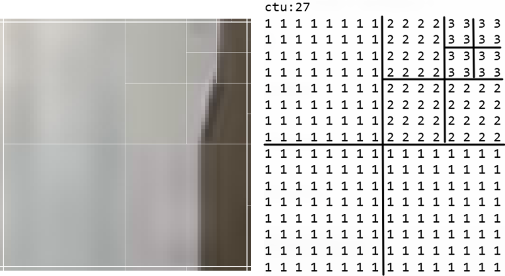

# HEVC-CU-depths-prediction-CNN
Using convolutional neural networks to predict the Coding Units (CUs) depths in HEVC intra-prediction mode. Achieve a trade-off between the encoding time in HEVC and the BDBR.

## Introduction
In HEVC intra-prediction mode, it takes the HEVC encoder a lot of time to decide the best depth for CTUs. So we try to use CNN to predict the CTU depth decision, and try to achieve a trade-off between the encoding time and the BDBR.

For a 64x64 CTU, the HEVC encoder predicts a 16x16 matrix to represent its depth decision. We can further process this 16x16 matrix and extract 16 labels to represent the depth prediction for a 64x64 CTU (because each 4x4 block in this matrix is identical). So in short, we can use a 64x64 CTU (which is an image) as the input of our network, and output a vector of length 16.

Directly predict 16 labels at one time is difficult for a neural network, so there're other ways to design the model. A 64x64 CTU corresponds to 16 labels. And if we divide it into four 32x32 CUs, then each 32x32 CU corresponds to only four labels, which makes the task easier.

The depths are 0, 1, 2 or 3. Depth 0 indicates that the 64x64 CU will be encoded as it is. Depth 1 indicates that the 64x64 CU will be further split into four 32x32 CUs and then be encoded, etc. Here's an example of a 64x64 CU and its depth decision:



For more information on a CNN approach to predict the CU depths for a 64x64 CTU, you can refer to these documents:

- [A deep convolutional neural network approach for complexity reduction on intra-mode HEVC](https://ieeexplore.ieee.org/document/8019316)
- [Fast CU Depth Decision for HEVC Using Neural Networks](https://ieeexplore.ieee.org/document/8361836)

## CNN model
Like mentioned above, we can directly use a 32x32 CU as input, and ouput 4 labels. But if we know how the depth 0/1/2/3 is decided, then this model doesn't make sense for depth-0, because a 32x32 CU is only part of a 64x64 CU, and it won't be sufficient to decide whether the 64x64 CU should be split or non-split.

So our model use both the 64x64 CU and the current 32x32 CU as input, and ouputs 4 labels indicating depths. Here's our architecture:


## Dataset & Loss Function
We generate our own dataset from YUV test sequences, refer to:

[HEVC-CU-depths-dataset](https://github.com/wolverinn/HEVC-CU-depths-dataset)

We use Cross Entropy Loss as loss function. For the four output labels, we calculate the Cross Entropy Loss seperately and then add them together.

## Validation
The **loss** of our trained model is: 3.1161

The **accuracy** of each label predicted is: 65.29%

The best way to evaluate the model is to integrate the model into the HEVC encoder. I've conceived a pipeline:

1. When HEVC encoder starts to process a new frame with frame number FrameNumber, it calls a command: ```python use_model.py -f FrameNumber```
2. The script ```use_model.py``` takes FrameNumber as input. It also reads the ```bitstream.cfg``` to get the YUV filename the HEVC is currently processing. If FrameNumber is 0, it first use FFmpeg to extract frames from the YUV file. Then, it processes certain frame, and for all the CTUs in this frame, it generates a ```CtuNumber.txt``` with a 16x16 matrix in it and store all the txt in a folder ```ctu```.
3. When HEVC encoder starts to process the CTU numbered CtuNumber, it goes to the ```ctu``` folder, find ```CtuNumber.txt``` and read the depths. In ```xCompressCU()```, if it's not at the predicted depth, then skip ```xCheckRDCostIntra()``` function.

I've already realized ```use_model.py```. Find it in ```./model test pipeline```.

Using this evaluating pipeline, we can compare the encoding time and BDBR at the same time.

I use a simpler approach to evaluate the increase in RD-cost for each YUV file. As ```xCompressCU()``` in HEVC encoder calculates the RD-cost exhaustively at each depth, we can get the RD-cost for every possible depth decision. Thus, we can realize comparison of RD-cost between the original encoder and the CNN model. See the ```model test pipeline``` folder for codes.

## To be continued...
Since we already know 1 label comes from a 16x16 CU, so we can simply predict 1 label at a time. The input can be a combination of 64x64, 32x32 and 16x16 CUs. I'm guessing this will achieve a smaller loss and higher accuracy... Also, I'd like to try some pre-trained models like ResNet, hopefully it will produce better results...